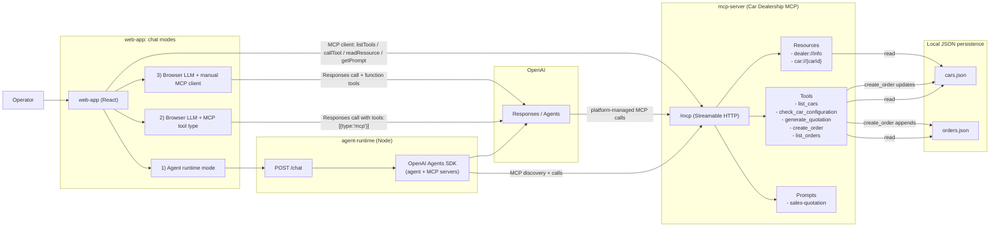

# Flows Between the 3 Apps (MCP)

```mermaid
flowchart LR
  U["Operator"] --> UI["web-app (React)"]

  subgraph W["web-app: chat modes"]
    direction TB
    UI --> M1["1) Agent runtime mode"]
    UI --> M2["2) Browser LLM + MCP tool type"]
    UI --> M3["3) Browser LLM + manual MCP client"]
  end

  subgraph AR["agent-runtime (Node)"]
    direction TB
    ARAPI["POST /chat"] --> AAG["OpenAI Agents SDK\n(agent + MCP servers)"]
  end

  subgraph OA["OpenAI"]
    direction TB
    RESP["Responses / Agents"]
  end

  subgraph MCP["mcp-server (Car Dealership MCP)"]
    direction TB
    MCPHTTP["/mcp (Streamable HTTP)"]
    TOOLS["Tools\n- list_cars\n- check_car_configuration\n- generate_quotation\n- create_order\n- list_orders"]
    RES["Resources\n- dealer://info\n- car://{carId}"]
    PROMPTS["Prompts\n- sales-quotation"]

    MCPHTTP --> TOOLS
    MCPHTTP --> RES
    MCPHTTP --> PROMPTS
  end

  subgraph DATA["Local JSON persistence"]
    direction TB
    CARS["cars.json"]
    ORDERS["orders.json"]
  end

  %% Flow 1: agent-runtime
  M1 --> ARAPI
  AAG --> RESP
  AAG -->|"MCP discovery + calls"| MCPHTTP

  %% Flow 2: browser MCP tool type
  M2 -->|"Responses call with tools:[{type:'mcp'}]"| RESP
  RESP -->|"platform-managed MCP calls"| MCPHTTP

  %% Flow 3: browser manual MCP client
  M3 -->|"Responses call + function tools"| RESP
  UI -->|"MCP client: listTools / callTool / readResource / getPrompt"| MCPHTTP

  %% Persistence
  TOOLS -->|"read"| CARS
  TOOLS -->|"read"| ORDERS
  TOOLS -->|"create_order updates"| CARS
  TOOLS -->|"create_order appends"| ORDERS
  RES -->|"read"| CARS
```
