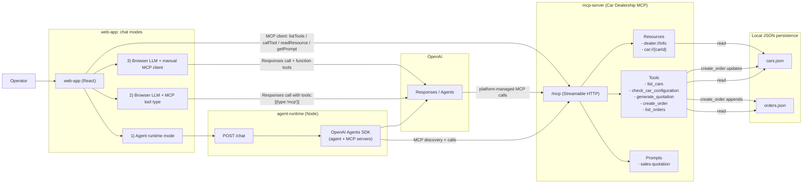

# MCP Car Dealer Demo — New Chat Context

Use this file as “project memory” when starting a new chat session.

## One-paragraph purpose
This repo is a **demo/training platform for Model Context Protocol (MCP)**. The business scenario is a **car seller** using a chat UI to **browse inventory, generate quotations, and create orders** via **typed MCP tools/resources/prompts** exposed by an MCP server.

There are **three client integration approaches** to show different ways an LLM can consume MCP:
1) **Agent Runtime (server-side)**: OpenAI Agents SDK consumes MCP via `mcpServers` (best security posture: keys server-side).
2) **Browser “Remote MCP” (platform-managed)**: OpenAI Responses API is given `tools: [{ type: 'mcp', ... }]` pointing at a public MCP URL (e.g., cloudflared).
3) **Browser “Manual Tools” (client-managed)**: Browser uses an MCP client, maps MCP tools to OpenAI function tools, and executes tools itself.

---

## Repo layout (3 subprojects)

### 1) `mcp-server/` — Car Dealership MCP Server
**Role**: Pure MCP contract + JSON persistence.

**Runs**: Streamable HTTP MCP endpoint at `http://localhost:4000/mcp` in dev.

**Core concepts exposed**:
- **Tools**: `list_cars`, `check_car_configuration`, `generate_quotation`, `create_order`, `list_orders`
- **Resources**: `dealer://info`, `car://{carId}`
- **Prompts**: `sales-quotation`

**Persistence**:
- `mcp-server/src/data/cars.json`
- `mcp-server/src/data/orders.json`

**Key file**:
- `mcp-server/src/server.ts` (tool/resource/prompt registration + HTTP transport)

---

### 2) `agent-runtime/` — Express “Agent Runtime” (OpenAI Agents SDK)
**Role**: A small Node server that:
- keeps `OPENAI_API_KEY` server-side,
- connects to the MCP server over Streamable HTTP,
- exposes `POST /chat` for the React UI.

**Runs**: `http://localhost:8787`
- `POST http://localhost:8787/chat` with `{ sessionId?, message }`
- in-memory conversation sessions (demo-friendly)

**Key files**:
- `agent-runtime/src/server.ts` (Express + Agents SDK + MCP server connection)
- `agent-runtime/src/server-utils.ts` (agent instructions / history preamble)

---

### 3) `web-app/` — React Chat UI
**Role**: Single-page chat UI with 3 modes that demonstrate the integration approaches.

**Runs**: Vite dev server (typically `http://localhost:5173`).

**Modes and where they live**:
- **Agent Runtime (process)**: `web-app/src/hooks/useAgentChat.ts`
- **Local LLM (remote MCP)**: `web-app/src/hooks/useChatRemoteMCP.ts`
- **Local LLM (manual tools)**: `web-app/src/hooks/useChat.ts`

**Mode selector**:
- `web-app/src/App.tsx`

---

## End-to-end architecture (flow)



---

## Quickstart (local dev)

### 0) Prereqs
- Node.js + npm
- OpenAI API key

### 1) Start MCP server
```bash
cd mcp-server
npm install
npm run dev
```
Expected: `http://localhost:4000/mcp`

### 2) Start agent-runtime (optional; only needed for “Agent Runtime” mode)
```bash
cd agent-runtime
npm install
OPENAI_API_KEY=... npm run dev
```
Defaults:
- `PORT=8787`
- MCP target: `MCP_SERVER_URL=http://localhost:4000/mcp`

### 3) Start web-app
```bash
cd web-app
npm install
npm run dev
```
Expected: Vite prints a local URL (commonly `http://localhost:5173`).

---

## Environment variables (what matters)

### `mcp-server/`
- `PORT` is optional.
  - `npm run dev` forces `PORT=4000` (see scripts)
  - `npm start` defaults to 3000 unless you set `PORT`

See: `mcp-server/.env.example`

### `agent-runtime/`
- `OPENAI_API_KEY` (preferred)
- `OPENAI_MODEL` (default `gpt-4.1-mini`)
- `MCP_SERVER_URL` (default `http://localhost:4000/mcp`)
- `PORT` (default 8787)

### `web-app/`
- `VITE_OPENAI_API_KEY` (browser modes; unsafe for production)
- `VITE_MCP_SERVER_URL` (manual-tools mode; default `http://localhost:4000/mcp`)
- `VITE_AGENT_RUNTIME_URL` (agent-runtime mode; default `http://localhost:8787`)
- `VITE_REMOTE_MCP_SERVER_URL` (remote-mcp mode; public MCP URL, e.g. cloudflared + `/mcp`)
- `VITE_REMOTE_MCP_SERVER_LABEL` (default `dealer-mcp`)

See: `web-app/.env.example`

---

## The 3 integration modes (what they demonstrate)

### A) Agent Runtime (process)
- UI calls agent-runtime: `POST /chat`
- agent-runtime uses Agents SDK with `mcpServers: [new MCPServerStreamableHttp({ url })]`
- Best for talking about: **security posture**, centralized policy, server-side keys.

Where:
- `web-app/src/hooks/useAgentChat.ts`
- `agent-runtime/src/server.ts`

### B) Local LLM (remote MCP)
- Browser calls OpenAI Responses with `tools: [{ type: 'mcp', server_url: ... }]`
- OpenAI handles discovery + tool calls (“platform-managed MCP”).
- Requires MCP server reachable from OpenAI (public URL).

Where:
- `web-app/src/hooks/useChatRemoteMCP.ts`

### C) Local LLM (manual tools)
- Browser connects an MCP client directly to the MCP endpoint
- `listTools()` → map into OpenAI “function tools”
- Tool loop executes `callTool` / `readResource` / `getPrompt` on the client

Where:
- `web-app/src/hooks/useChat.ts`

Notes:
- This mode includes bridge tools `mcp_read_resource` and `mcp_get_prompt` so the model can access MCP resources/prompts.

---

## MCP server contract (what the LLM can do)

### Tools
- `list_cars({ showSold? })`
- `check_car_configuration({ make?, model?, year?, engine?, trim?, status? })`
- `generate_quotation({ carId, discountPct? })` (discount capped at 30)
- `create_order({ carId, customerName, agreedPrice })` (marks car as sold + persists order)
- `list_orders({ status? })`

### Resources
- `dealer://info` (dealership contact info)
- `car://{carId}` (car details; aligns with `uri` returned by tools)

### Prompt
- `sales-quotation({ carId, customerName, discountPct? })`

---

## Presenter script (5–8 minutes)
A good deterministic live flow:
1) “Show me all available electric cars.” → `check_car_configuration`
2) “Give me a quote for car c1 with 10% discount.” → `generate_quotation`
3) “Create an order for car c1, customer Maria Ionescu, agreed price 21150.” → `create_order`
4) “List all orders.” → `list_orders`
5) “Draft a short sales email for Alex Popescu about car c2 with 7% discount.” → `sales-quotation` prompt usage

See also: `mcp-server/docs/mcp-demo/06-end-to-end-script.md`

---

## Resetting data (if the demo modified state)
- Reset orders:
  - set `mcp-server/src/data/orders.json` to `[]`
- Reset sold cars:
  - set affected cars’ `status` in `mcp-server/src/data/cars.json` back to `"available"`

---

## Common pitfalls / gotchas
- **Port mismatch**: MCP dev uses 4000 by script; production start defaults to 3000 unless `PORT` is set.
- **Browser API key exposure**: browser modes require `VITE_OPENAI_API_KEY` and are workshop-only.
- **Remote MCP requires a public URL**: set `VITE_REMOTE_MCP_SERVER_URL` to your tunnel URL + `/mcp`.

---

## Notes about docs drift
Some older docs under `mcp-server/docs/mcp-demo/` reference a separate `dealer-chat` repo/path. In this workspace the UI is `web-app/`.

---

## If you’re an AI assistant starting work
Suggested first questions to ask the user (only if needed):
- Which mode are we targeting (agent / remote-mcp / manual-tools)?
- Are we allowed to put OpenAI keys in the browser for this session (workshop) or should we use agent-runtime only?
- Is the MCP endpoint local (`localhost:4000/mcp`) or a public tunnel URL?
